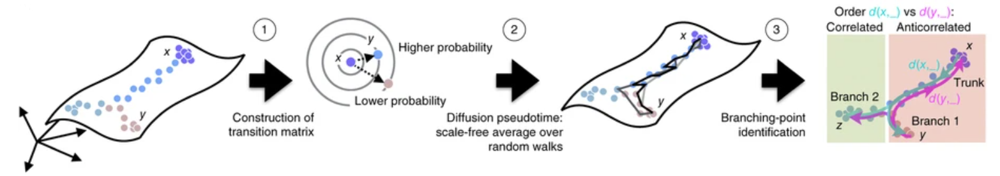
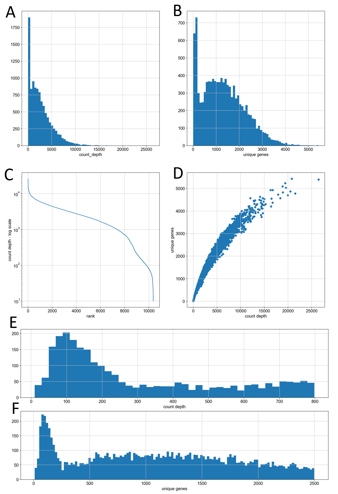
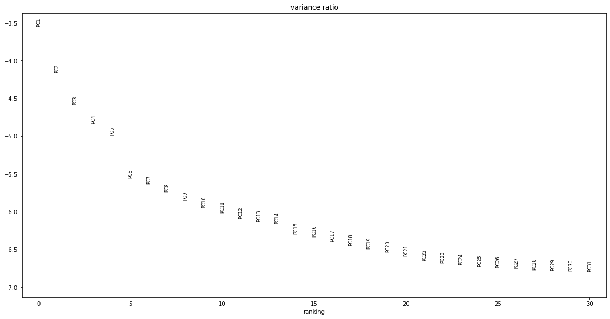
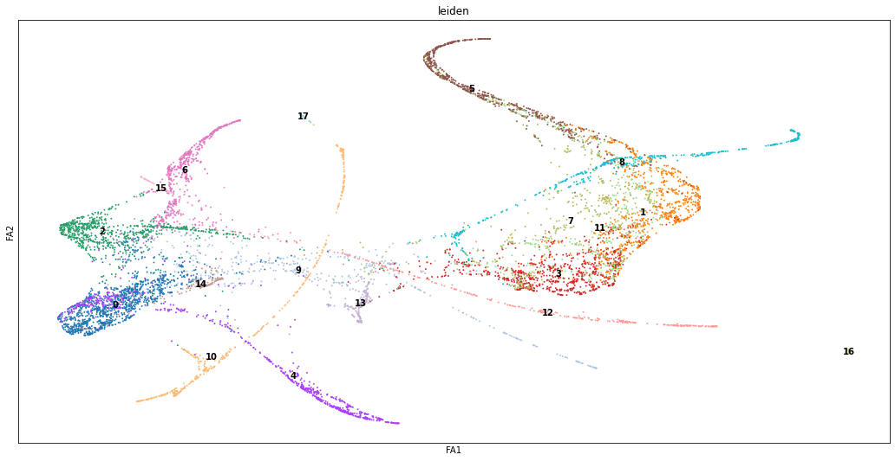
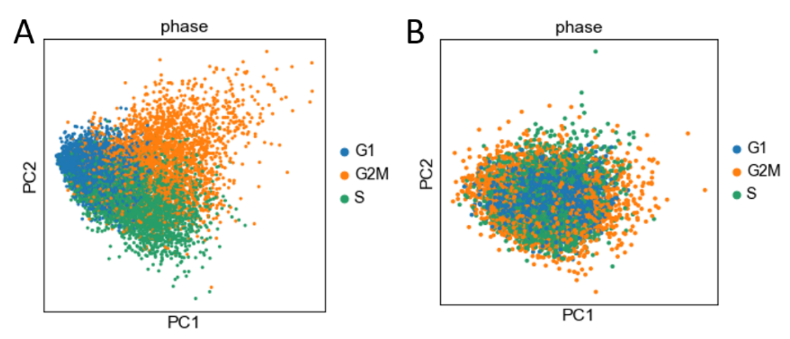

# Trajectory Analysis of Single-Cell mRNA Sequencing Data 
**TODO:** MAKE GITHUB PAGE PUBLIC AND SHARE LINK, ENSURE REPO IS PRIVATE BEFORE SUBMISSION

**Authors:** Josh Bishop, Anjana Dissanayaka, Vishal Manickman, Nina Moorman, Jay Wroe

**Instructor:** Prof. Mahdi Roozbahani

**Submitted:** November 13, 2022

## Introduction/Background 
### Topic
Single-cell mRNA sequencing (scRNA-seq) has generated petabytes of data detailing the transcriptomesI of billions of cells, generating insights ranging from biomarkersII of disease states to the discovery of new cell-types. Diverse methods for generating these data cause high variability in the number & similarity of cells sequenced, and mRNAs sequenced per cell[6,11,12]. Developing robust methods for sc-RNAseq analysis is critical to standardizing analytical results and expediting scientific discoveries[6,11,12].

### Dataset & Features
Our primary dataset is a 27297x10396 array[5]. Rows indicate genes, and columns indicate mouse stem cells collected over a 7-day differentiation protocol. Entries are unique observations of mRNAs encoding gene R in cell C. Two scientific journal articles have identified 5 cell types at 3 stages of maturity in these data[3,5].
Genes with few observations are statistically unreliable, and dead cells are a source of confounding noise. Regressing gene expression against background processes (e.g. cell division) further reduces noise. After cleaning, typical scRNA-seq analyses focus on 100s-1000s of genes in 1000-5000 cells[6].

## Problem Definition & Motivation
Robust methods for interpreting transcriptomicI responses to arbitrary stimuli can yield insights into disease state evolution and aid in the development of novel therapies. Diffusion PseudotimeIII analysis (DPT) is a method for ordering cells along a continuous process and is robust to batch effects on sampling density and sequencing depth, making it a flexible tool for classifying cells[3].
Our goals are: (1) identify distinct populations of cells differentiating from a common origin, and (2) determine the physiological role of those populations.

### Potential results and Discussion
#### Research Questions
* **RQ1.** Can we order cells along an arbitrary branching process using scRNA-seq data? 

* **RQ2.** Can we determine the identity of cells near terminal points in the above process using scRNA-seq data?

### Methods:
#### Data Cleaning
Harvesting cells or tissues and creating single-cell suspensions inevitably damages the cell membranes of some fraction of the cells present in the sample, destroying their ability to maintain homeostatic conditions and leading to rapid deterioration of cell surface features and internal environment. Any biological assay aiming to analyze bulk or single cell characteristics must include a cleaning step to identify and exclude these dead and damaged cells.
In scRNA-seq analysis, this is typically done by studying two key parameters of an initial read-count dataset: count depth and unique gene counts. Count depth describes the total number of RNA molecules in a particular cell that were sequenced and successfully mapped to a gene, and can be computed as the sum of the observation counts of all genes in the dataset for a given cell. Unique gene counts indicate how many different genes were observed one or more times within each cell, and can be computed as the number of nonzero column entries for each cell. These parameters are selected for cleaning scRNA-seq data because mRNA molecules in the cytoplasm of a cell are extremely unstable following membrane damage and are quickly destroyed. This leads to a stark reduction in the number of mappable mRNAs present in a cell, which will typically result in low count depth. Cells with low transcriptomic activity, or a large amount of internal compartmentation can deviate from this trend, however.
Unique gene counts can be used to detect these outliers, because the primary source of mRNAs that _are_ shielded inside of organelles within the cell are mitochondria. mRNAs in mitochondria are derived from a limited subset of genes compared to mRNAs found elsewhere in the cell cytoplasm. In a healthy and metabolically active cell, the abundance of mitochondrial mRNA would not be disproportionately reflected in the number of genes that are sequenced, meaning that the number of unique gene counts would remain high. However, in the case of damaged cells, the metabolic activity would likely decrease, which would cause the ratio of mitochondrial mRNA to cytoplasmic mRNA to increase and consequently reduce the number of unique genes per cell. 
We plotted histograms of count depth and unique genes per cell, and in each case observed a bimodal distribution for each of these features, in keeping with the underlying biological theory (**Fig. 1 A,B**). This bimodality is also visible in the two-shelf structure of (**Fig. 1 C**), which shows the count depths of the unfiltered cells in descending order. A plot of count depth versus unique genes showed a single narrow distribution with a weakly exponential association (**Fig. 1 D**), indicating that for our particular dataset, high-quality filtering could be accomplished with only one of these features, but we implemented both to maintain the generalizability of our platform. In keeping with standard practices for the field we visually estimated minimum thresholds of count-depth (**Fig. 1E**) and unique genes (**Fig. 1F**) for the boundary between the “low” and “typical” populations, but we intend to implement a two-component, two-dimensional gaussian mixture model to objectively discriminate these populations in our final report.

Our data cleaning process involved first removing genes which were not observed in any cells from the count matrix, which reduced our dataset from ~27300 features to ~16200 features, removing cells with a count depth below 300, which reduced the dataset from ~10400 to ~8800 observations, and then removing cells with fewer than 500 unique genes, which further reduced the dataset to exactly 8100 observations. 

#### Data Preprocessing
We take care of missing features in our dataset by removing genes with low count values in the data cleaning process. The original dataset includes a reference list of all genes known to be expressed in mice, and it is normal for many of them to be absent in actual sequencing data. With >16000 out of 27300 possible features remaining in the dataset, confident identification of cells' position and trajectory in transcriptomic space is still very achievable. 
The first step in our data preprocessing is gene count normalization. We rely on the ``sc.pp.normalize_total`` function in order to convert the raw gene count for each cell into counts out of 10,000. By doing this, the effect of cell-to-cell variations in count depth can be removed from measures of cell-to-cell variance in the relative levels of expression of individual genes. Following this normalization, we reduce the feature-space of our dataset by removing low-variance features, which hold little information about the differences between cells in our dataset which we leverage to cluster cells and predict their trajectory in gene expression space. We isolate the most variable genes using ``sc.pp.highly_variable_genes``. We determine the min and max mean input parameters as well as the min dispersion coefficient from prior work[13]. This reduced the features space of our sequencing data from 16216 to 2242 features.

#### Unsupervised Subproject - Graph Inference
Our aim here is to compute a nearest-neighbor’s graph of the distribution of our cells in this high-variance subspace, and then use that manifold to assign cells a DPT score between 0 and 1, describing their relative level of progression from the “root” point of this process to a terminal point. This is then used to order the cells along a continuous developmental process according to previously described methods[3]. Calculation of DPT scores with scanpy.tl.dpt requires selecting a small number of “diffusion components”, <code>n_dcs</code>, to represent the highly-variable gene space for the subsequent computation of the transition matrix. We noted values in the literature for this and equivalent function that range from 2 to 30; the function’s default value is 15. We determined our value for n_dcs by visualizing the amount of variance explained by each principal component defined by an SVD decomposition. As seen in **Fig. 2A**, there are two elbow points at which the variance ratio drops noticeably, which is why we decided to use the first 14 principal components to use in our nearest-neighbors computation.
We then used these 14 components to generate a graph of the nearest-neighbors using <code>scanpy.pp.neighbors</code> (**Fig. 2B**). This mapping was then passed into the scanpy.tl.dpt function to compute a transition matrix, which contains the probability of any given cell in our dataset transitioning into any other cell while following random walks between neighboring cells in gene-expression space. This transition matrix is then used to assign each cell a diffusion-pseudotime score between 0 and 1, with 0 indicating a “root cell” and 1 indicating the most distant cell in expression space according to the random walk behavior described above.

#### Supervised Subproject - Graph Annotation
Cells undergo mitosis to divide and replenish the cells that have died. At equilibrium, there is a balance between cells that are dividing and cells that are carrying out metabolic processes unique to that cell type. Correspondingly, these cells express genes that are either ubiquitous to all cell division or unique to the functions of a given cell type. In order to remove the interference of cell division genes in cell-to-cell variation, we first need to identify genes that are associated with the DNA synthesis (S phase) stages of mitosis.
To start, we take lists of known genes associated with different phases of the cell cycle, and we assign each cell an S-score that is a function of enrichment for those known genes (i.e. percentage of reads in a cell that are made up of S phase biomarkers). This score will serve as a normalized description of whether the S phase biomarkers are abundant or scarce in the cell.
We then perform a regression of the expression of all the genes in the cell against the S-score for a given cell. Regressing out the variance for being in a given phase of the cell cycle allows us to determine the cell type regardless of the phase it is in, such that the remaining variance is due to the phenotype of the cell and not the phase of the cell cycle. 
Cell-cycle scoring/regression resulted in a dataset that showed no effect of the cell cycle through PCA analysis. **Figure 3A** represents PCA reduction on the original data before cell-cycle regression. It is clear from this figure that cells can be separated by their cell cycle stages when these genes are the primary features. **Figure 3B** represents PCA reduction after regressing out the cell-cycle gene effects. The reprojected dataset shows no clear separation between the different phases of the cell-cycle, indicating effective elimination of cell-cycle effects from our dataset. 

In our project, we compare the Kendall rank correlation of the data before and after cell-cycle regression to quantify the correlation between rankings of our dataset by collection date and by DPT score for each cell. Running this test allows us to compare how the accuracy of our predicted DPT score changes after cell-cycle regression. Kendall rank correlation is described in greater detail in the Quantitative Metrics section of this report.
We will determine the physiological role of the differentiated cells by mapping their transcriptomes to representative transcriptomes of labeled archetypes using <code>scanpy.tl.ingest</code>, which takes in a reduced-dimension representation of the reference data generated with <code>scanpy.tl.umap</code>. Taken together with the DPT ranking of each cell type, we can assemble a complete story of how likely each cell type is to transition between different lineages on a continuum.

In our project, we compare the Kendall rank correlation of the data before and after cell-cycle regression to quantify the correlation between rankings of our dataset by collection date and by DPT score for each cell. Running this test allows us to compare how the accuracy of our predicted DPT score changes after cell-cycle regression. Kendall rank correlation is described in greater detail in the Quantitative Metrics section of this report.
We will determine the physiological role of the differentiated cells by mapping their transcriptomes to representative transcriptomes of labeled archetypes using <code>scanpy.tl.ingest</code>, which takes in a reduced-dimension representation of the reference data generated with <code>scanpy.tl.umap</code>. Taken together with the DPT ranking of each cell type, we can assemble a complete story of how likely each cell type is to transition between different lineages on a continuum.

#### Quantitative Metrics
##### Unsupervised:
We used <code>scipy.stats.kendalltau</code> to determine the Kendall rank correlation between DPT score and collection date for the sequenced cells before and after regressing the sequencing data against its levels of expression of cell-cycle marker genes. This metric returns tau and a p_value. Tau is a value in the range of [-1, 1], which can be interpreted to mean that the two inputs (X and Y) are strongly correlated (tau ~ 1), not correlated (tau ~ 0), or anticorrelated (tau ~ -1). The p_value is the probability that our null hypothesis – that there exists no correlation between datasets X and Y – is true. We hypothesized that DPT score is correlated with the collection date, and therefore tau would be close to 1 and the p_value greater than the generally accepted threshold of 0.05.
When comparing the similarity between the datasets when ordered by DPT scores or by collection date before implementing a regression against each cell’s S and G2m scores, we found that the tau value was just 0.06, indicating a lack of correlation between the two orderings. Interestingly, after the regression was performed we still observed a low tau value of 0.04. Furthermore, both cases resulted in a p-value of much less than 0.05, which also indicates the lack of a correlation. Both of these suggest that our ordering of cells does not properly capture when the cells were sampled throughout the course of the experiment, and that our processed and reduced dataset is therefore not capturing the variance underlying the maturation and differentiation processes set out to characterize.

##### Supervised:
Given the ground truths, we can employ matching-based (e.g. F-measure), entropy-based (e.g. Normalized mutual information), or pairwise measures (e.g. Jaccard coefficient) to evaluate supervised classification. All methods will use a Euclidean distance metric in transcriptomic space.

### Results and Discussion
In this work, we were able to successfully clean up our dataset using functions available to us via SciPy. Using both the number of unique gene counts per cell and the overall abundance of gene counts across all samples, we reduced the size of our data to just 8100 single-cell entries with 2242 highly-variable genes of interest. By running PCA, we found that 14 of these features explained a substantial amount of variance. Using these features we were able to cluster the observations by collection date, increasing our confidence that these features were correctly chosen. 
We hypothesized that the primary processes driving this variation are the cell cycle and the maturation of progenitor cells into mature phenotypes. In order to test this, we used the sequencing results to inform how we order the cell entries along a continuum of how likely each cell is to transform into their neighboring entries with diffusion pseudotime (unsupervised learning). When assessing the efficacy of our DPT implementation using the Kendall rank correlation metric, we observed that the ordering of our cleaned and preprocessed cells was not similar to if the cells were ordered by when they were collected. In parallel, we looked at how we can remove the influence of cell growth-related genes on the clustering of cells. By regressing the sequenced transcriptome against relative expression of S phase-related genes, we were able to remove nearly all evidence of clustering by cell cycle (i.e. G1, S, G2M).

### Future Work
At this point in our project we have completed our data cleaning and preprocessing, and have made an initial attempt at implementing an unsupervised learning process to order the cells according to time-dependent processes. The work conducted for this midterm report focused on addressing RQ1, investigating whether we can effectively order cells along an arbitrary branching process using scRNA-seq data. Moving forward, we will investigate the role of terminally differentiated cells in RQ2,  and will evaluate our supervised and unsupervised models on our validation dataset of cells that are annotated with their physiological function. We will additionally improve the rank ordering and consequently the Kendall rank correlation score obtained thus far, with the following techniques.
We first propose to employ non-metric multidimensional scaling (NMDS) via the <code>sklearn.manifold.MDS()</code> function. This entails passing in the dissimilarity matrix, computing rank-order distances with which the original distances are regressed on, and using this regressed distance to compute the Kruskal Stress (alignment of rank-order with regressed list of original distances). We can then reorganize rank-order until Stress falls below our stress threshold, indicating proper alignment in reduced-dimension space. 
We additionally propose to perform an Analysis of Similarity (ANOSIM) via the <code>skbio.stats.distance.anosim()</code> function. This function takes in as a parameter the dissimilarity matrix and outputs a measure of the difference between groups of samples to determine if a specific group is more responsible for the variation than the entire group taken together. Note that ANOSIM does not assume a certain distribution of data. 

## Proposed Timeline & Contribution Table

## Definition of Terms
1. Transcriptome - “A transcriptome is the full range of messenger RNA, or mRNA, molecules expressed by an organism. The term ‘transcriptome’ can also be used to describe the array of mRNA transcripts produced in a particular cell or tissue type.”
2. Biomarker - A molecule whose presence is indicative of some process, e.g. the development of a disease state, or the metabolization of certain toxins.
3. Pseudotime - An abstracted notion of time or another independent variable associated with a continuous (time-dependent) process (e.g. the evolution of a system from state A to state B), which can be used to describe and order intermediate positions in that process.

## References
- Aizarani, N., Saviano, A., Sagar _et al_. A human liver cell atlas reveals heterogeneity and epithelial progenitors. _Nature_ 572, 199–204 (2019). https://doi.org/10.1038/s41586-019-1373-2 
- Anthony Gitter. Single-cell RNA-seq pseudotime estimation algorithms. 2018. https://doi.org/10.5281/zenodo.1297422 (GitHub:https://github.com/agitter/single-cell-pseudotime) 
- Haghverdi, L., Büttner, M., Wolf, F. _et al_. Diffusion pseudotime robustly reconstructs lineage branching. _Nat Methods_ 13, 845–848 (2016). https://doi.org/10.1038/nmeth.3971 
- He Z, Peng C, Li T and Li J. Cell Differentiation Trajectory in Liver Cirrhosis Predicts Hepatocellular Carcinoma Prognosis and Reveals Potential Biomarkers for Progression of Liver Cirrhosis to Hepatocellular Carcinoma. _Front Genet_ 13:858905 (2022). https://doi.org/10.3389/fgene.2022.858905 
- Klein AM, Mazutis L, Akartuna I, Tallapragada N _et al_. Droplet barcoding for single-cell transcriptomics applied to embryonic stem cells. _Cell_ 161(5):1187-1201 (2015). https://doi.org/10.1016/j.cell.2015.04.044
- Luecken, M. D., & Theis, F. J. Current best practices in single‐cell RNA‐SEQ Analysis: A tutorial. _Mol Syst Biol_, 15(6) (2019). https://doi.org/10.15252/msb.20188746 
- MacParland, S.A., Liu, J.C., Ma, XZ. _et al_. Single cell RNA sequencing of human liver reveals distinct intrahepatic macrophage populations. _Nat Commun_ 9, 4383 (2018). https://doi.org/10.1038/s41467-018-06318-7 
- Mu, T., Xu, L., Zhong, Y. _et al_. Embryonic liver developmental trajectory revealed by single-cell RNA sequencing in the Foxa2eGFP mouse. _Commun Biol_ 3, 642 (2020). https://doi.org/10.1038/s42003-020-01364-8 
- Pedregosa, F. _et al_. Scikit-Learn: Machine Learning in Python. _Scikit-Learn_ 12, 2825–2830 (2011). https://dl.acm.org/doi/10.5555/1953048.2078195 
- Wolf, F., Angerer, P. & Theis, F. SCANPY: large-scale single-cell gene expression data analysis. _Genome Biol_ 19, 15 (2018). https://doi.org/10.1186/s13059-017-1382-0 
- Zappia L, Phipson B, Oshlack A. Exploring the single-cell RNA-seq analysis landscape with the scRNA-tools database. _PLoS Comput Biol_ 14(6): e1006245 (2018). https://doi.org/10.1371/journal.pcbi.1006245 
- Zappia, L., Theis, F.J. Over 1000 tools reveal trends in the single-cell RNA-seq analysis landscape. _Genome Biol_ 22, 301 (2021). https://doi.org/10.1186/s13059-021-02519-4
